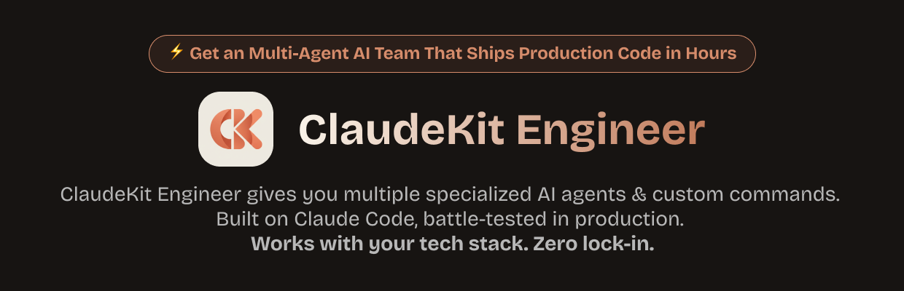

# ClaudeKit Agent Skills (Free Collection)

## Repository overview
- **Purpose**: Share the free `.claude/skills/*` folders that power the open ClaudeKit workflows.
- **Source**: Mirrors the Agent Skills shipped with the **Claude Engineer** toolkit stored in [ClaudeKit.cc](https://claudekit.cc).
- **Audience**: Indie builders, startups, and teams who want a starting point for disciplined Claude Code automations.

## What lives inside `.claude/skills/*`
Each folder under `.claude/skills/` bundles:
- **Mission brief**: Opinionated instructions that keep Claude focused on shipping real work instead of generic chat.
- **Guardrails**: Step-by-step checklists and fallback actions that make outputs reviewable and auditable.
- **Integration hints**: Suggested MCP connections, file structures, and prompts so you can plug skills directly into your repositories.

The directories are intentionally human-readable. Copy a skill, tweak the text files, and commit it alongside your project—Claude Code will pick it up automatically on the next run.

## Claude Code at a glance
Recent updates make Claude Code an ideal companion for these skills:
- **Parallel web sessions**: Launch multiple coding tasks from the browser, steer them mid-flight, and let Claude open pull requests when it finishes.
- **Security-first sandboxing**: Grant scoped filesystem and network access so Claude can fetch dependencies or run tests without exposing the rest of your infrastructure.
- **On-the-go iteration**: Use the iOS preview to nudge a session while you are away from your laptop.

(See Anthropic’s [Claude Code on the web](https://www.anthropic.com/news/claude-code-on-the-web) announcement and Ars Technica’s coverage of the new sandbox runtime for deeper context.)

## Skills catalog

### 🔐 Authentication & Security
- **`better-auth/`** - Comprehensive TypeScript authentication framework supporting email/password, OAuth, 2FA, passkeys, and multi-tenancy. Works with any framework (Next.js, Nuxt, SvelteKit, etc.).

### 🎨 Design & Creative
- **`canvas-design/`** - Create museum-quality visual art in PDF/PNG using design philosophy. Generates aesthetic movements first, then expresses them visually through masterful composition, typography, and color theory.

### 🛠️ Development Tools
- **`claude-code/`** - Complete guide to Claude Code features: slash commands, hooks, plugins, MCP servers, agent skills, IDE integration, and enterprise deployment.
- **`imagemagick/`** - Command-line image processing for format conversion, resizing, cropping, effects, watermarks, and batch operations across 250+ formats.
- **`mcp-builder/`** - Build high-quality MCP servers in Python (FastMCP) or TypeScript. Includes agent-centric design principles, evaluation harnesses, and best practices.
- **`repomix/`** - Package entire repositories into single AI-friendly files (XML, Markdown, JSON). Perfect for codebase analysis, security audits, and LLM context generation.

### 📚 Documentation & Research
- **`docs-seeker/`** - Intelligent documentation discovery using llms.txt standard, GitHub repository analysis via Repomix, and parallel exploration agents for comprehensive coverage.

### 🐛 Debugging & Quality
- **`debugging/defense-in-depth/`** - Validate at every layer data passes through. Make bugs structurally impossible with entry validation, business logic checks, environment guards, and debug logging.
- **`debugging/root-cause-tracing/`** - Trace bugs backward through the call stack to find original triggers. Fix at the source, not the symptom.
- **`debugging/systematic-debugging/`** - Four-phase framework ensuring root cause investigation before fixes. Never jump to solutions.
- **`debugging/verification-before-completion/`** - Run verification commands and confirm output before claiming success. Evidence before claims, always.

### 📄 Document Processing
- **`document-skills/docx/`** - Create, edit, and analyze Word documents with tracked changes, comments, formatting preservation, and redlining workflows for professional documents.
- **`document-skills/pdf/`** - Extract text/tables, create PDFs, merge/split documents, fill forms. Uses pypdf and command-line tools for programmatic PDF processing.
- **`document-skills/pptx/`** - Create and edit PowerPoint presentations with layouts, speaker notes, comments, animations, and design elements.
- **`document-skills/xlsx/`** - Build spreadsheets with formulas, formatting, data analysis, and visualization. Includes financial modeling standards and zero-error formula requirements.

### 🧠 Problem-Solving Frameworks
- **`problem-solving/collision-zone-thinking/`** - Force unrelated concepts together to discover emergent properties. "What if we treated X like Y?"
- **`problem-solving/inversion-exercise/`** - Flip core assumptions to reveal hidden constraints and alternative approaches. "What if the opposite were true?"
- **`problem-solving/meta-pattern-recognition/`** - Spot patterns appearing in 3+ domains to find universal principles worth extracting.
- **`problem-solving/scale-game/`** - Test at extremes (1000x bigger/smaller, instant/year-long) to expose fundamental truths hidden at normal scales.
- **`problem-solving/simplification-cascades/`** - Find one insight that eliminates multiple components. "If this is true, we don't need X, Y, or Z."
- **`problem-solving/when-stuck/`** - Dispatch to the right problem-solving technique based on your specific type of stuck-ness.

### 🔧 Meta Skills
- **`skill-creator/`** - Guide for creating effective skills with specialized workflows, tool integrations, domain expertise, and bundled resources.

## Getting started
- **Install**: Clone this repo or copy selected folders into your own project.
- **Customize**: Edit the instruction files to match your processes, owners, and tools.
- **Run**: Open Claude Code, connect the repository, and select the skill that aligns with your task. Claude will follow the playbook while you supervise the diffs.

## Extend beyond the free tier
This collection covers the essentials. If you need advanced regulated-industry skills, analytics dashboards, or tailored onboarding, explore the full ClaudeKit package at [ClaudeKit.cc](https://claudekit.cc). The commercial bundle stays subtle but unlocks deeper automation while keeping the same transparent workflow philosophy.
